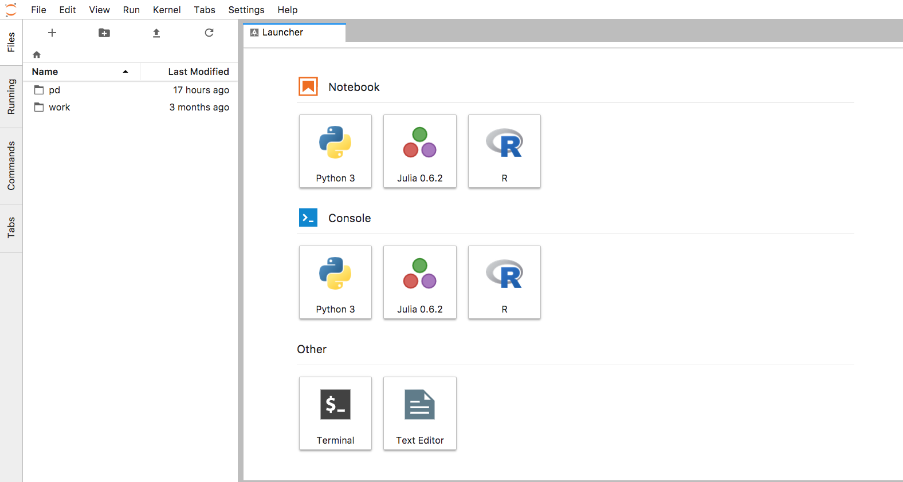

## Introduction

Host your own Jupyter Lab server with Google Kubernetes Engine.

## Steps

1. Create a cluster.

	```
	gcloud container clusters create jupyter-test --zone=us-central1-a --num-nodes=1 --machine-type=n1-standard-64 --disk-size=100 --cluster-version=1.9.2-gke.1
	```

1. Create a persistent disk.

	```
	gcloud compute disks create jupyter-pd --size 200GB --zone=us-central1-a
	```

1. Get the cluster credential

	```
	gcloud container clusters get-credentials --zone us-central1-a jupyter-test
	```

1. Deploy the load balancer and Jupyter Lab server container.

	```
	kubectl create -f jupyter.yaml
	```

1. Get the external IP of the load balancer, and navigate to it in a browser.

	```
	kubectl get service
	```

	Or go to [the console](https://console.cloud.google.com/kubernetes/discovery)

1. Login with the token `TOKEN_FOR_LOGIN`, which is specified in `jupyter.yaml`.

	You should see:

	

1. The mounted persistent disk at `/home/jovyan/pd` should be used to hold the notebooks you create so they will not be lost on cluster shutdown.


## Clean up

1. Delete the cluster.

	```
	gcloud container clusters delete jupyter-test --zone=us-central1-a
	```

2. **After you back up the changes you made**, delete the persistent disk.

	```
	gcloud compute disks delete jupyter-pd --zone=us-central1-a
	```


## Caveats

1. This is not suitable as a shared environment.  Use [Kubeflow]() instead.

2. If you make changes to the mounted git repositories (in this example it is the [ml-on-gcp]() GitHub repository), you need to make sure to push the commits to a remote repository, otherwise the changes will be overwritten when you redeploy the server.
